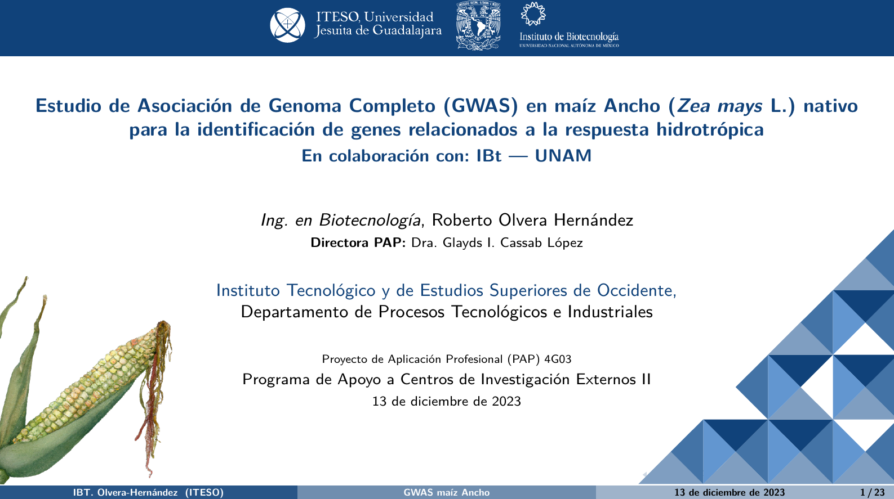
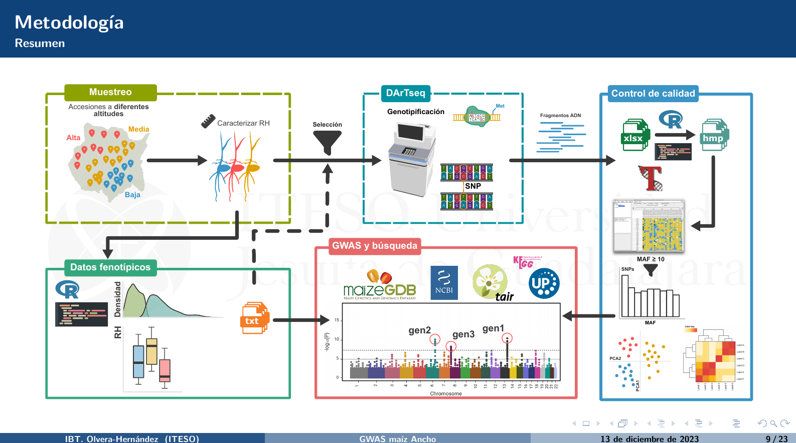
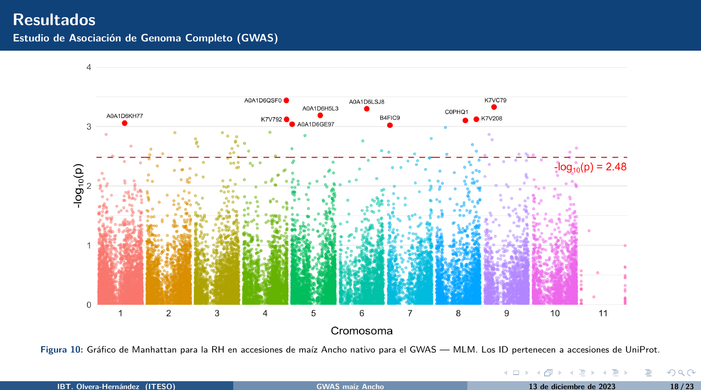

# Thesis Presentation: GWAS for native maize diversity

This presentation was made using (LaTeX) Beamer. 

For compilation, please use **LuaLaTeX/XeLaTeX** compilation due to `fontspec` package. Available in most [MikTeX](https://miktex.org/) and [TeXLive Full](https://tug.org/texlive/) distributions, or you can compile online using [Overleaf](https://es.overleaf.com/).

## Preview

